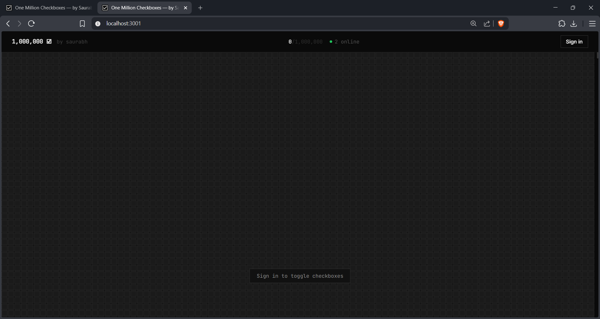
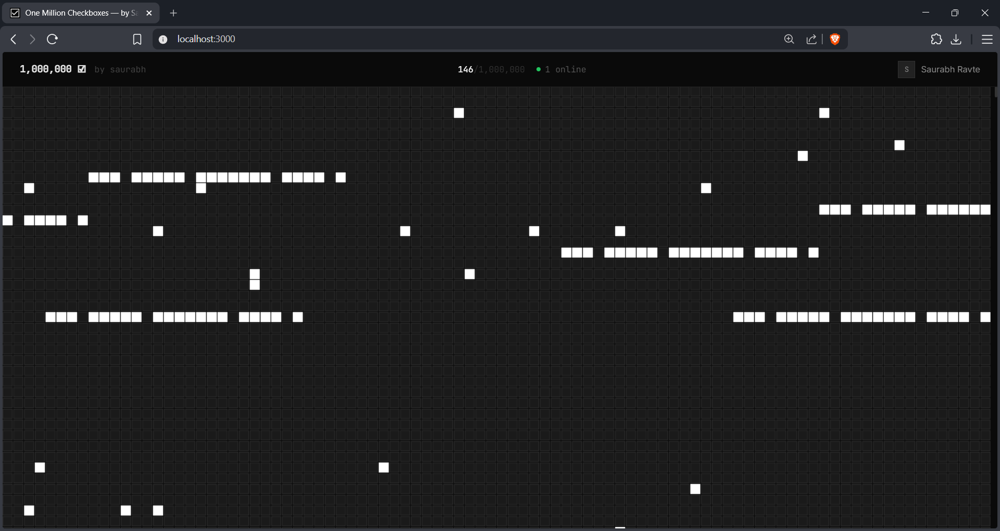

# ☑ One Million Checkboxes

### by Saurabh

A real-time web application where users can toggle 1,000,000 checkboxes simultaneously, with changes reflected instantly across all connected users.

---

## Screenshots

> 
> 

---

## 📹 Demo Video

> https://youtu.be/0A2EPtefSp4

---

## Tech Stack

| Layer     | Technology                                   |
| --------- | -------------------------------------------- |
| Frontend  | React 18, TypeScript, Vite, Tailwind CSS     |
| Backend   | Node.js, Express, TypeScript                 |
| Real-time | WebSockets (ws library)                      |
| Auth      | Clerk (Google OAuth) + Custom email/password |
| Container | Docker, Docker Compose                       |

---

## Features

- **1,000,000 checkboxes** rendered via HTML5 Canvas (virtual scrolling)
- **Real-time sync** — toggle any checkbox, all users see it instantly
- **Redis bitfield** — 1M checkbox states stored in ~122 KB
- **Redis Pub/Sub** — cross-instance broadcasting for horizontal scaling

---

## Project Structure

```
one-million-checkbox/
├── docker-compose.yml
├── client/                        # Vite + React frontend
│   ├── src/
│   │   ├── components/
│   │   │   ├── AuthModal.tsx      # Login/register modal
│   │   │   ├── CheckboxGrid.tsx   # Canvas-based virtual grid
│   │   │   ├── ClerkSync.tsx      # Clerk → backend session sync
│   │   │   └── Header.tsx         # Top bar with stats
│   │   ├── hooks/
│   │   │   ├── useCheckboxState.ts # Bitfield state management
│   │   │   └── useWebSocket.ts    # WS connection + auth
│   │   ├── lib/
│   │   │   ├── api.ts             # HTTP API client
│   │   │   └── AuthContext.tsx    # Auth state + session
│   │   ├── pages/
│   │   │   └── App.tsx            # Main page
│   │   ├── styles/
│   │   │   └── globals.css        # Tailwind + custom CSS
│   │   └── types/
│   │       └── index.ts           # Shared TypeScript types
│   ├── vite.config.ts
│   └── tailwind.config.js
│
└── server/                        # Express + TypeScript backend
    └── src/
        ├── server.ts              # Entry point — HTTP + WS startup
        ├── app.ts                 # Express app + routes
        ├── websocket.ts           # WebSocket server + pub/sub
        ├── common/
        │   ├── config/
        │   │   └── db.ts          # Redis connection (client/pub/sub)
        │   ├── dto/
        │   │   └── baseDto.ts     # Base response shapes
        │   ├── middleware/
        │   │   └── validate.middleware.ts
        │   └── utils/
        │       ├── apiError.ts    # Custom error class
        │       ├── apiResponse.ts # sendSuccess / sendError helpers
        │       └── jwt.utils.ts   # JWT decode utility
        └── modules/
            ├── auth/
            │   ├── dto/
            │   │   └── register.dto.ts
            │   ├── auth.controller.ts
            │   ├── auth.middleware.ts
            │   ├── auth.models.ts
            │   ├── auth.routes.ts
            │   └── auth.services.ts
            └── checkbox/
                ├── dto/
                │   └── checkbox.dto.ts
                ├── checkbox.controller.ts
                ├── checkbox.models.ts
                ├── checkbox.ratelimit.ts
                ├── checkbox.routes.ts
                └── checkbox.services.ts
```

---

## Running Locally

### Prerequisites

- Node.js 20+
- pnpm (or npm)
- Docker & Docker Compose
- Redis (via Docker or local install)

### Option A — Docker Compose (recommended)

```bash
# 1. Clone the repo
git clone https://github.com/SaurabhRavte/one-million-checkbox
cd one-million-checkbox

# 2. Set up environment variables
cp server/.env.example server/.env
cp client/.env.example client/.env
# Edit both .env files with your values

# 3. Start everything
docker-compose up --build

# App: http://localhost:3000
# API: http://localhost:4000
# Redis: localhost:6379
```

### Option B — Local Dev (hot reload)

```bash
# Terminal 1 — Redis
docker run -p 6379:6379 redis:7-alpine

# Terminal 2 — Backend
cd server
cp .env.example .env    # fill in values
npm install
npm run dev             # ts-node-dev with hot reload

# Terminal 3 — Frontend
cd client
cp .env.example .env    # fill in values
npm install
npm run dev             # Vite dev server at http://localhost:3000
```

---

## Environment Variables

### Server (`server/.env`)

| Variable                | Description                   | Required           |
| ----------------------- | ----------------------------- | ------------------ |
| `PORT`                  | Server port (default: 4000)   | No                 |
| `REDIS_URL`             | Redis connection URL          | Yes                |
| `CLERK_SECRET_KEY`      | Clerk secret key              | For Google OAuth   |
| `CLERK_PUBLISHABLE_KEY` | Clerk publishable key         | For Google OAuth   |
| `CLERK_WEBHOOK_SECRET`  | Svix webhook secret           | For Clerk webhooks |
| `NODE_ENV`              | `development` or `production` | No                 |
| `CLIENT_URL`            | Frontend URL for CORS         | Yes                |

### Client (`client/.env`)

| Variable                     | Description           | Required         |
| ---------------------------- | --------------------- | ---------------- |
| `VITE_CLERK_PUBLISHABLE_KEY` | Clerk publishable key | For Google OAuth |
| `VITE_API_URL`               | Backend API URL       | Yes (prod)       |
| `VITE_WS_URL`                | WebSocket server URL  | Yes (prod)       |

---

## Redis Setup

Redis is used for three things:

**1. Bitfield (checkbox state)**

```
Key: checkboxes:bitfield
Type: String (binary bitfield)
Size: ~122 KB for 1,000,000 bits
Operations: GETBIT, SETBIT, BITCOUNT
```

**2. Pub/Sub (real-time broadcast)**

```
Channel: checkbox:updates
Publisher: checkbox.services.ts (on every toggle)
Subscriber: websocket.ts (broadcasts to all WS clients)
```

**3. Rate limiting (sliding window)**

```
Key pattern: rl:{namespace}:{identifier}
Type: Sorted Set (scores = timestamps)
TTL: auto-expiring per window
```

To inspect Redis state:

```bash
redis-cli
> BITCOUNT checkboxes:bitfield          # total checked
> GETBIT checkboxes:bitfield 42         # check index 42
> ZCARD rl:ws:user123                   # rate limit counter
```

---

## Auth Flow

### Email/Password

1. `POST /api/auth/register` — hashes password (SHA-256 + secret salt), stores user in Redis
2. `POST /api/auth/login` — verifies hash, issues random 32-byte session token
3. Session token stored in Redis with 7-day TTL: `session:{token} → userId`
4. Client stores token in `localStorage`, sends as `Authorization: Bearer {token}`
5. `auth.middleware.ts` verifies on every protected route

### Google OAuth (Clerk)

1. Frontend uses `@clerk/clerk-react` `<SignIn />` component
2. After Clerk sign-in, `ClerkSync.tsx` detects the signed-in Clerk user
3. Calls `POST /api/auth/clerk/exchange` with `{ clerkUserId, email, name }`
4. Backend upserts user in Redis, issues our own session token
5. Identical session flow from here on

### WebSocket Auth

1. Client connects to `ws://host/ws`
2. On open, sends `{ type: "auth", token: "..." }`
3. Server calls `verifySession(token)` and attaches `userId` to socket
4. Only authenticated sockets can send `toggle` messages

---

## WebSocket Flow

```
Client                          Server
  |                               |
  |──── WS connect ──────────────▶|
  |◀─── { type: "connected" } ────|
  |                               |
  |──── { type: "auth", token }──▶|
  |◀─── { type: "auth_ok" } ──────|
  |                               |
  |──── { type: "toggle", index }▶|  ← rate check → Redis toggle → Pub/Sub publish
  |◀─── { type: "toggle_ok" } ────|
  |                               |
  |           [Redis Pub/Sub broadcasts to all server instances]
  |                               |
  |◀─── { type: "checkbox_update", index, checked } (broadcast to all clients)
```

---

## Rate Limiting Logic

Implemented in `checkbox.ratelimit.ts` using Redis sorted sets — **no external packages**.

**Algorithm: Sliding Window**

```
Key: rl:{namespace}:{identifier}
On each request:
  1. ZREMRANGEBYSCORE key -inf (now - windowMs)   ← remove old entries
  2. ZADD key now "now-random"                     ← record this request
  3. ZCARD key                                     ← count in window
  4. If count > maxRequests → reject (429)
  5. EXPIRE key windowSeconds                     ← auto-cleanup
```

**Rate limits applied:**
| Context | Limit | Window | Identifier |
|---|---|---|---|
| WebSocket toggles | 10 | 1 second | userId |
| HTTP toggle endpoint | 30 | 10 seconds | userId |
| HTTP state reads | 100 | 60 seconds | IP |

---

## Deploying Online

### Railway (simplest)

```bash
# Install Railway CLI
npm install -g @railway/cli
railway login

# Deploy from project root
railway up

# Add Redis plugin in Railway dashboard
# Set environment variables in Railway dashboard
```

### Render

1. Create a new Web Service for `server/` directory
2. Create a new Static Site for `client/` directory
3. Add Redis from Render's add-ons
4. Set environment variables

### Docker on VPS (DigitalOcean/Hetzner)

```bash
# On your VPS
git clone https://github.com/yourusername/one-million-checkbox
cd one-million-checkbox

# Set env vars
cp server/.env.example server/.env && nano server/.env
cp client/.env.example client/.env && nano client/.env

# Start
docker-compose up -d --build

# With nginx reverse proxy on port 80/443, proxy to :3000
```
